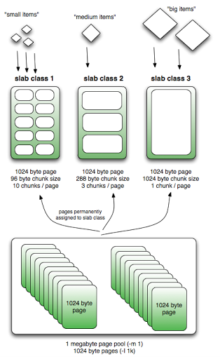

In this day and age, we are seeing a data explosion. 90% of all data ever created has been created in the last 2 years and most of it is unstructured.

Interestingly, in-memory and generic (key-value pair) data storage has gained prominence compared to the more traditional relational databases of the past..

Memcached is the gold standard for caching in the IT world with almost every one using it. It retains this spot because of its simplicity.

[https://memcached.org/](https://memcached.org/)

* Free and open source
* Generic key-value store
* High performance and distributed caching system
* True cache sitting in front of slower databases
* In-memory caching

## How it works

* Memory is broken into fixed size allocators called slab_class.
* Each slab_class allocates a fixed size.
   * Each slab_class has memory pages (default 1MB) assigned to it
   * Each page is finally divided into the chunks of the “slabs fixed size” eg., 0-1k, 1k-4k,….
   * 
   * (image credit: [http://nosql.mypopescu.com/post/13506116892/memcached-internals-memory-allocation-eviction](http://nosql.mypopescu.com/post/13506116892/memcached-internals-memory-allocation-eviction))
   * Values will always be stored to the chunk with the size closest to the slab chunk size
   * When a slab gets full and TTL (time-to-live) for a chunk is expired then LRU is used to evict. So eviction is within the scope of a slab and not at top level.
      * Eviction is done per slab, so one can start evicting while there is plenty of space in another slab.
      * Lazy-eviction: When the TTL is expired, it doesn’t reclaim memory immediately by triggering eviction. It is done either by another access to it or when memory is full in the slab.
   * We can configure Memcached to lazy allocate more pages to slabs instead of doing it at the start.
   * When memory is full for the slab and we are trying to allocate, it uses LRU within the slab to evict chunks whose TTL has expired.

## Clustering

* Clustering is a misnomer in Memcached.
   * The server is "dumb". Nodes in a cluster don’t communicate and are blind. Again simplicity even at this level enabled Memcached to be very fast and effective. The server relies on a client to use the hash algorithm to figure which node in the cluster to get the key-value from.
   * *So there is no master node.*
* Clients all use the same hashing to hit the cache.

## Client

* A client either wants to store a key-value pair or hit the cache with a key.
* It uses a hashing algorithm to map a key to a node in a cluster and then checks if it can find the key-value in the Memcached server node.
* The client specifies TTL for the key-value.

## Limits

* Key max is 250 bytes
* Value max is 1MB

## Notes

* Everything is in-memory, so there is no persistence unlike other caches like Redis (Redis and its built-in persistence is the [next topic in this series](caching-redis.html). It relies on slower backend on a cache miss.
* Cannot traverse all items (As this operation is slow and will block others)
* When a new node is added to a cluster, one has to be mindful of losing existing cached data as there is no redistribution. (Because the client does the node access, this data is simply lost.)
   * Care should be taken to add one node at a time instead of adding a bunch together.
* Don’t use simple mod like key to cluster node mapping. Almost everybody uses [consistent hashing](https://community.oracle.com/blogs/tomwhite/2007/11/27/consistent-hashing) to minimize the data loss when a node is removed or added. 
